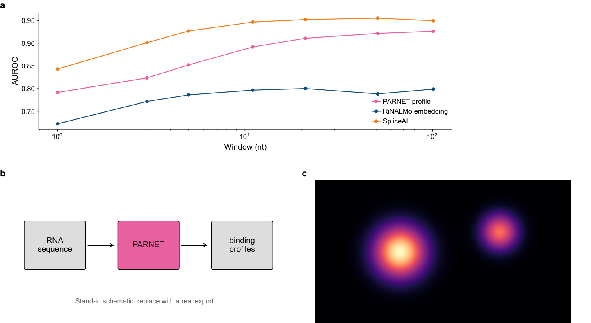

# Example figure

A working example of a figure folder.
Copy it to start a new figure: see [figures/README.md](../README.md).

| Panel | Content              | Made with                                                       |
| ----- | -------------------- | --------------------------------------------------------------- |
| A     | Score vs window size | `notebooks/panel_A_scores.py`, from `data/scores.tsv`           |
| B     | Schematic            | `notebooks/panel_B_schematic.py`, places `assets/schematic.pdf` |
| C     | Image                | `notebooks/panel_C_image.py`, places `assets/image.png`         |

Build it with `pixi run figure _example`.

