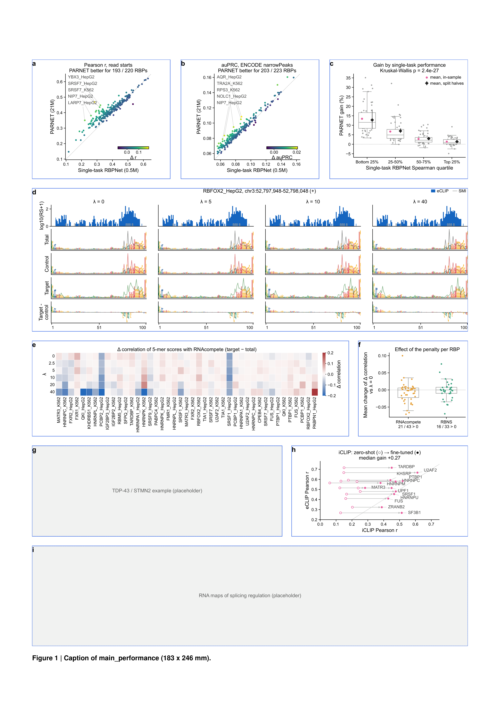

# main_performance

Figure 2 of the manuscript: PARNET performance against single-task RBPNet, the effect of the penalty on the mixing coefficient, and iCLIP.
Issue: [#4](https://github.com/marsico-lab/parnet--paper/issues/4).
The draft this figure replaces is `reference/figure2_draft_2026-10.png`.

| Panel | Content | Made with |
| ----- | ------- | --------- |
| `perf_pearson` | Per-RBP Pearson r, single-task RBPNet vs PARNET | `notebooks/perf_pearson.py`, `data/perf/per_rbp_correlations.tsv` |
| `perf_auprc` | Per-RBP auPRC against ENCODE narrowPeaks | `notebooks/perf_auprc.py`, `data/perf/per_rbp_auprc.tsv` |
| `perf_quartiles` | PARNET gain per quartile of single-task Spearman, with split-half control | `notebooks/perf_quartiles.py`, `data/perf/quartile_gain*.tsv` |
| `region_featimp` | RBFOX2_HepG2 region: predictions and attributions per track and penalty | `notebooks/region_featimp.py`, `data/region_featimp/` |
| `kmer_heatmap` | Target-vs-total 5-mer contrast with RNAcompete per penalty | `notebooks/kmer_heatmap.py`, `data/kmer_contrast/` |
| `kmer_benefit` | Mean change of that contrast vs λ = 0, RNAcompete and RBNS | `notebooks/kmer_benefit.py`, `data/kmer_contrast/` |
| `tdp43_example` | Placeholder: TDP-43 / STMN2 example (collaborator image) | `notebooks/tdp43_example.py` |
| `iclip` | iCLIP zero-shot vs fine-tuned, one arrow per RBP | `notebooks/iclip.py`, `data/iclip/` |
| `rna_maps` | Placeholder: RNA maps (collaborator image) | `notebooks/rna_maps.py` |

The origin of every table is in [data/README.md](data/README.md).
Build it with `pixi run figure main_performance`.

